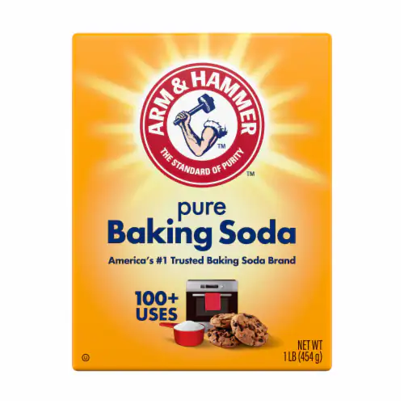
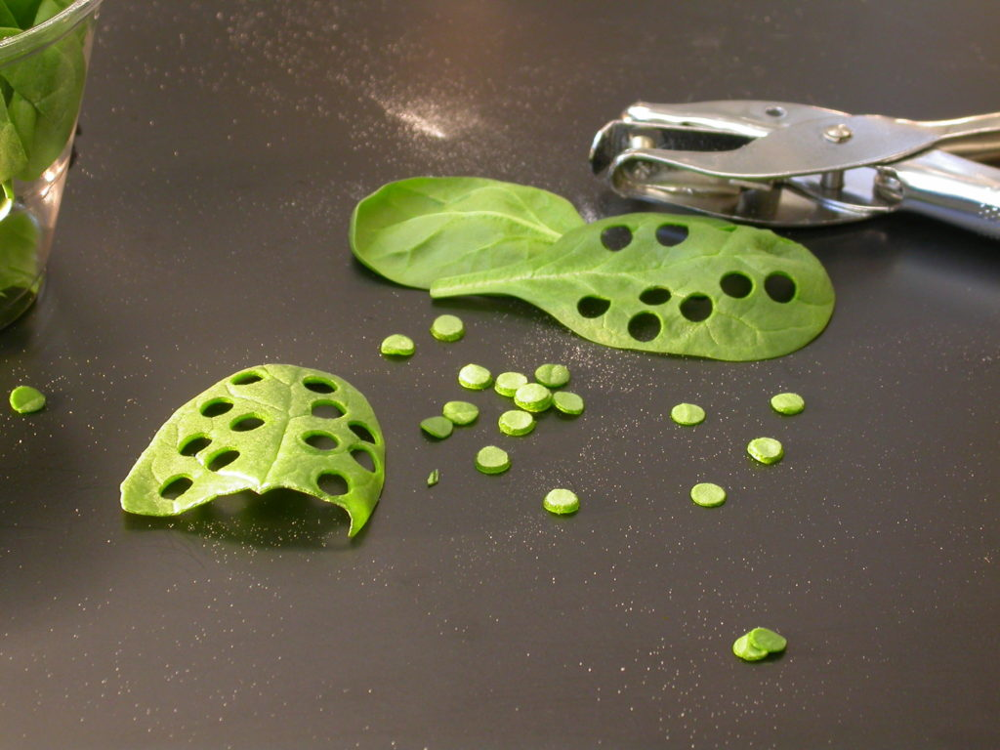
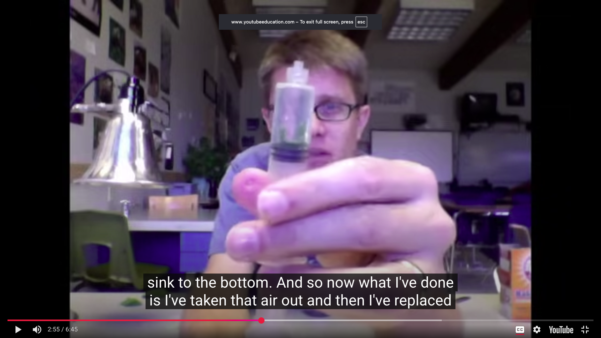
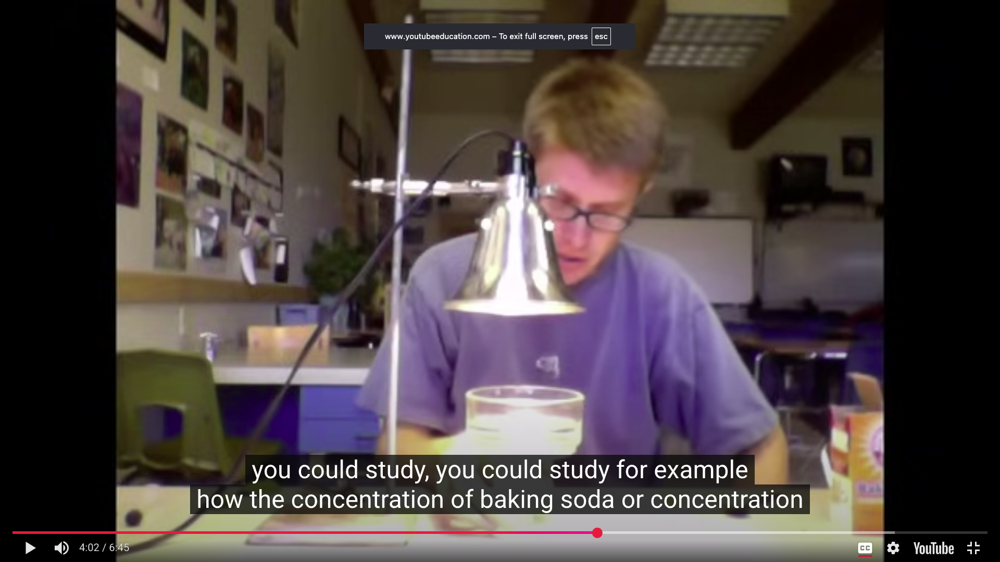

# Photosynthesis lab

## This note is about how to prepare the lab experiment that wil take place on 12/9/25

### preparation materials

- 1.5 g sodium bicarbonate _(baking soda)_
  
- liquid dish soap
- Eyedropper
- plastic syringe (20-65 mL)- **with no needle**
- Plastic spoon or straw _stirring_
- Leaf
- hole punch
- 1 large beaker or plastic cup
- 2 small beaker or plastic cup
- light source
- Paper towel

## steps

### video

- [leafprep](https://www.youtube.com/watch?v=ZnY9_wMZZWI&authuser=0)

- Gather the leaf and hole punch the hole between the veins they are called _leaf chad_
  

- When pleasing in the chad load them in the needle and push out the hole and take in water with the lead chad in it

- hold thumb on the top and pull down and shake it to remove the air
  

- place the leaf in the test beaker and pull it out of the bottom

- take out a lamp then place a container on top of the beaker with water in it to take the heat
  

- observe effect of the carbon on the light such as color and etc

- this will create bubbles and measure the rate of photosynthesis aka the time it take for the leaf to float back up
