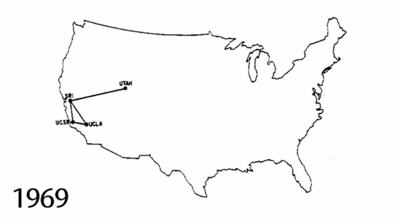

# Key Moments in the History of the Internet



### _Early ARPANET network Map_

## From the Cold War to the Web

The internet grew out of Cold War fears and the need to keep communication open during a open nuclear attack. Over time, government research, networking experiment, and new software helped transform ARPANET into the foundation of the modern internet

| Year | event                   | Importance                                                                                                   |
| ---- | ----------------------- | ------------------------------------------------------------------------------------------------------------ |
| 1957 | Sputnik                 | The soviet union launched Sputnik, increasing U.S fears during the Space Race.                               |
| 1958 | ARPA created            | The United States created ARPA to support advanced research and defense projects                             |
| 1969 | APRANET established     | ARPANET linked four universities and became the foundation for the modern internet                           |
| 1971 | First email sent        | Ray Tomlinson sent the first email and helped popularize. the use of @ symbol                                |
| 1972 | TCP/IP developed        | Vinton Cerf and Robert Kahn developed the communication protocols that made network connection more reliable |
| 1984 | Internet is born        | ARPANET split into MILNET and ARPANET, marking a major step in the birth of the internet                     |
| 1989 | World Wide Web Invented | Tim Berners-Lee invented the World Wide Web.                                                                 |
| 1991 | Web goes public         | The World Wide Web became available to the public.                                                           |

```
"The internet has its origin in the fear of nuclear war."
```

ARPANET was important because it showed that distant computers could commuicate across ta shared network. It was designed to avoid a single point of failutre,
