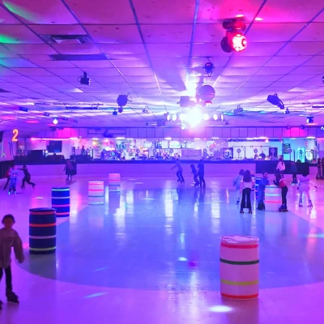

# Modest Proposal part 1

## Ana

1.  their issue is the lack of animals variety and housing
1.  Their voice of authority FFA 48
1.  false solution have declared making the whole school a animal housing
1.  proper solution is to allow more animals and make the pens more suitable
    

### scoring

3

## Vanesa P

1.  Restroom locks as a issue
1.  Minnesota highschool as voice of authority
1.  false solution is removal of stalls
1.  fix the locks
    

### score

5

## Alexander Vosburg

1.  their issue is the food
1.  voice of authority is califronia department
1.  remove free food and add in a battlepass for food access
1.  better food budget
    

### scoring 1

## Fernado

1.  issue is awful bathroom
1.  california papers
1.  Remove public restroom and add a lottery each day for 5 students only to use clean bathroom and limit hydration
1.  real solution is to add a reporting system to better maintain the restroom

### scoring

    3

## Glemae A

1.  issue is school food
1.  Voice of authority chef's foundation
1.  Proposed 1000 dollar price tag on food or hard math or make students eat dirt and worms
1.  The school should prepare school food by hand
    

#### scoring

3

## Addie L

1. issue is phone addiction
1. voice of authority is puberty search
1. phone is controlled by school
1. real solution is phone pouches
   

### scoring

3

## Jackie I

1. issue is passing period
1. doctor david is their source
1. wheels on shoes for faster transport
1. real solution is increased passing period time and more routes to get to classes
   

### scoring

4

# Top 3

| first place | Second place | Third place |
| ----------- | ------------ | ----------- |
| Vanesa P    | Jackie I     | Fernado     |
